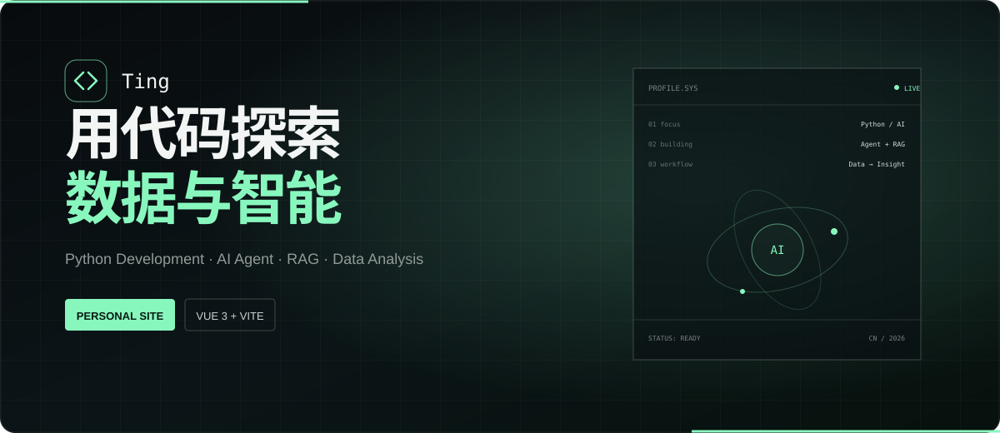

<div align="center">

# Ting · 程序员个人介绍网站

### 用代码探索数据与智能
<br />



<br />


[](https://personal-site-rose-alpha-40.vercel.app/)
[](https://github.com/greenhand886)
[](https://vuejs.org/)
[](https://vercel.com/)


**一个面向求职展示的深色科技风个人网站，呈现个人信息、技术能力、项目经历与实习经验。**

[在线体验](https://personal-site-rose-alpha-40.vercel.app/) ·
[项目仓库](https://github.com/greenhand886/personal-site) ·
[联系邮箱](mailto:1786024918@qq.com)

</div>

---

## ✨ 项目亮点

| 🎨 深色科技风 | 📱 响应式设计 | 🧩 内容组件化 | ⚡ 轻量稳定 |
| --- | --- | --- | --- |
| 数据实验室视觉语言与细腻交互 | 适配桌面端与移动端浏览 | 个人信息与项目数据集中管理 | 纯前端静态站点，快速加载部署 |

- 单页滚动式布局，清晰呈现求职方向与个人能力
- 项目卡片直达三个对应的 GitHub 项目仓库
- 导航平滑滚动、阅读进度、卡片与标签 Hover 效果
- 联系邮箱支持点击复制，并提供清晰反馈
- 支持 `prefers-reduced-motion`，兼顾无障碍体验

## 🧭 页面模块

```text
首页介绍 → 关于我 → 技术能力 → 项目经历 → 实习经历 → 联系方式
```

## 🛠️ 技术栈

| 分类 | 使用技术 |
| --- | --- |
| 前端框架 | Vue 3、TypeScript |
| 构建工具 | Vite |
| 样式实现 | CSS、响应式布局、CSS Animation |
| 代码托管 | GitHub |
| 部署平台 | Vercel |
| AI 辅助 | Codex、ChatGPT、frontend-design skill |

## 🚀 核心项目

| 项目 | 简介 | 技术栈 |
| --- | --- | --- |
| [高校学生成绩分析与智能预警系统](https://github.com/greenhand886/student_warning_project) | 基于学生成绩数据构建随机森林预测模型，支持学业风险分析与预警 | Python、Flask、Scikit-learn、Random Forest |
| [Job Agent 简历匹配与优化系统](https://github.com/greenhand886/job-agent-mvp) | 使用大模型能力实现简历解析、JD 分析、匹配评估与优化建议 | Python、Streamlit、LLM API、Prompt Engineering |
| [RAG 企业知识库问答系统](https://github.com/greenhand886/EnterpriseQAsys) | 实践文档管理、文本切分、向量检索与问答生成流程 | Flask、Vue 3、MySQL、RAG、向量检索 |

## 📂 项目结构

```text
personal-site/
├─ docs/
│  └─ readme-banner.svg
├─ src/
│  ├─ components/
│  │  ├─ ProjectCard.vue
│  │  ├─ SectionHeading.vue
│  │  └─ SiteHeader.vue
│  ├─ data/
│  │  └─ portfolio.ts
│  ├─ App.vue
│  ├─ main.ts
│  └─ styles.css
├─ index.html
├─ package.json
└─ vite.config.ts
```

## 💻 本地运行

```bash
git clone https://github.com/greenhand886/personal-site.git
cd personal-site
npm install
npm run dev
```

打开终端显示的地址，通常为 `http://localhost:5173`。

## 📦 构建与预览

```bash
npm run build
npm run preview
```

生产构建产物会生成在 `dist` 目录。

## 🌐 部署

本项目已部署至 Vercel：

### [personal-site-rose-alpha-40.vercel.app](https://personal-site-rose-alpha-40.vercel.app/)

在 Vercel 中导入仓库后，使用以下配置即可部署：

```text
Framework Preset: Vite
Build Command: npm run build
Output Directory: dist
Install Command: npm install
```

---

<div align="center">

Built with Vue 3, Vite and a little curiosity.

</div>
